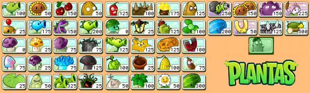
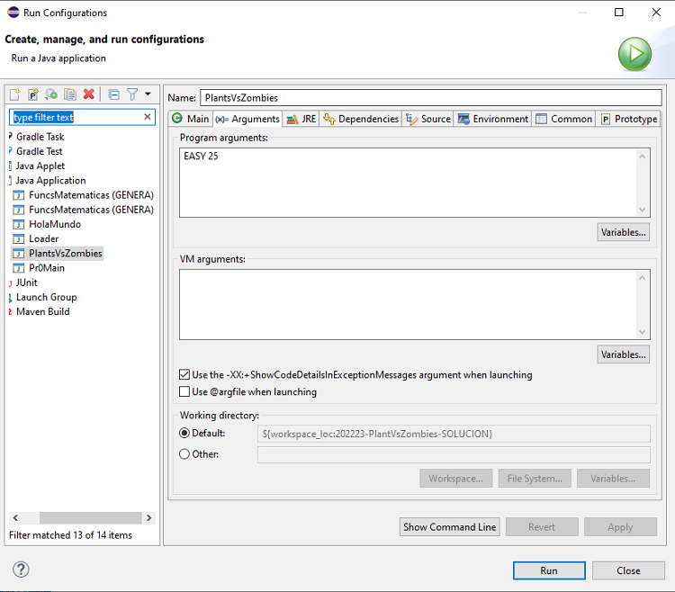

# Práctica 1: Plantas contra zombis

**Entrega: Semana del 17 de octubre**
 
**Objetivo:** Iniciación a la orientación a objetos y a Java; uso de arrays y enumerados; manipulación de cadenas con la clase `String`; entrada y salida por consola.

**Preguntas Frecuentes**: Como es habitual que tengáis dudas (es normal) las iremos recopilando en este [documento de preguntas frecuentes](faq.md). Para saber los últimos cambios que se han introducido [puedes consultar la historia del documento](https://github.com/informaticaucm-TPI/202223-PlantsVsZombies/blob/main/enunciados/practica1/faq.md).

<!-- TOC start -->
  * [Control de copias](#control-de-copias)
- [1. Descripción de la práctica](#1-descripción-de-la-práctica)
  * [1.1 Introducción](#11-introducción)
  * [1.2. Detalles sobre la práctica](#12-detalles-sobre-la-práctica)
  * [Objetos del juego](#objetos-del-juego)
    + [Planta lanzaguisantes](#planta-lanzaguisantes)
    + [Girasol](#girasol)
    + [Zombi Común](#zombi-común)
- [2. Organización del juego](#2-organización-del-juego)
  * [2.1 Draw](#21-draw)
  * [2.2 User Action](#22-user-action)
    + [Observaciones sobre los comandos](#observaciones-sobre-los-comandos)
  * [2.3 Game actions](#23-game-actions)
  * [2.4 Update](#24-update)
- [3. Detalles de implementación ](#3-detalles-de-implementación)
  * [3.1 Inicialización del juego](#31-inicialización-del-juego)
  * [3.2 Clases que componen nuestra aplicación](#32-clases-que-componen-nuestra-aplicación)
    + [3.3 Observaciones a la implementación](#33-observaciones-a-la-implementación)
- [4. Entrega de la práctica](#4-entrega-de-la-práctica)
- [5. Pruebas](#5-pruebas)
<!-- TOC end -->

<!-- TOC --><a name="control-de-copias"></a>
## Control de copias

Durante el curso se realizará control de copia de todas las prácticas comparando las entregas de todos los grupos de TPI. Se considera copia la reproducción total o parcial de código de otros alumnos o cualquier código extraído de Internet o de cualquier otra fuente, salvo aquellas autorizadas explícitamente por el profesor. 

En caso de detección de copia se informará al Comité de Actuación ante Copias que citará al alumno infractor y si considera que es necesario sancionar al alumno propondrá una de las tres siguientes medidas:


- Calificación con cero en la convocatoria de la asignatura a la que corresponde la prueba.
- Calificación con cero en todas las convocatorias del curso actual.
- Apertura de expediente académico ante la Inspección de Servicios de la Universidad.

<!-- TOC --><a name="1-descripción-de-la-práctica"></a>
# 1. Descripción de la práctica

<!-- TOC --><a name="11-introducción"></a>
## 1.1 Introducción

Plantas contra zombis es un juego desarrollado para móviles muy popular estilo *tower defense*. Según la Wikipedia:

> Los zombis aparecen mientras suena una alarma. El jugador va disponiendo diferentes plantas con distintas características de ataque o defensa para detener a la horda de zombis que intenta devorar los cerebros de los residentes. Los zombis presentan diferentes atributos y habilidades, como cavar por debajo de las plantas o saltar por encima de estas con la ayuda de pértigas, llevar diferentes objetos como casco o conos, escaleras o globos.

A nivel visual el juego se presenta como una cuadrícula en la que el jugador coloca plantas con diferentes características; los zombis aparecen de un lado del tablero y el jugador tiene que resistir su ataque, destruyéndolos a todos. En el caso de que uno de los zombis supere la defensa y llegue hasta el final del tablero, el usuario pierde la partida. Conforme se van superando niveles aparecen nuevos tipos de plantas y zombis con diferentes habilidades. Existen versiones gratuitas de dicho juego para multitud de plataformas. Si no has jugado nunca, te recomendamos que lo hagas antes de comenzar a hacer la práctica. 


Durante las próximas prácticas vamos a ir desarrollando progresivamente nuestra propia versión del juego. Empezaremos con una versión muy reducida e iremos incrementando la complejidad del juego. En la primera práctica tenemos como objetivo implementar el juego mediante el interfaz consola. 

En el juego original hay multitud de tipos de planta, que determinan su función, su coste, el tiempo que tarda en crecer, la cantidad de daño que infiere a los zombis, su resistencia, etc. Veamos algunas de las que aparecen en el juego original:

- **Lanzaguisantes**: Dispara guisantes a los zombis.
- **Girasol**: Proporciona soles (la moneda del juego).
- **Petacereza:** Explota grupos de zombis en un área pequeña.
- **Nuez**: Bloquea a los zombis y protege las plantas.
- **Hielaguisantes**:  Dispara guisantes helados que ralentizan y dañan.
- **Repetidora**:  Dispara dos guisantes a la vez.
- **...**




Si quieres ver la lista entera puedes consultar la [página de Plant vs Zombies en la Wikipedia](https://es.wikipedia.org/wiki/Plantas_contra_Zombis).

Además de funciones diferentes, cada planta tiene un coste, que medimos en unidades de sol o soles. El usuario puede ir acumulando soles para plantar nuevas plantas. Los soles se acumulan gracias a un tipo de plantas especiales: los girasoles. En el juego original también aparecen soles del cielo pero, por ahora, solo recolectaremos soles usando los girasoles.

Por supuesto, también hay distintos tipos de zombis a los que combatir:

- **Zombi común**: Zombi de jardín común.
- **Zombi caracono**: Su cono lo hace más resistente que el zombi de jardín común.
- **Saltador de pértiga**: Salta la primera planta que encuentra.
- **Zombi caracubo**: Su cubo lo hace muy resistente. 
- **Zombi deportista**: Un zombi muy rápido y resistente.
- **...**


Como decíamos anteriormente, en la primera práctica vamos a utilizar el interfaz consola para programar una versión reducida, con muy pocos elementos. En las prácticas siguientes iremos aumentando la complejidad. En la siguiente sección vamos a describir exactamente lo que tenemos que implementar.

<!-- TOC --><a name="12-detalles-sobre-la-práctica"></a>
## 1.2. Detalles sobre la práctica

En nuestra primera práctica vamos a considerar que el juego consta de un tablero de **4 × 8 casillas** (4 filas por 8 columnas) En cada casilla podemos colocar una sola planta o puede haber un zombi. Los zombis avanzan de derecha a izquierda y ganan la partida cuando alguno llega al final del tablero. Por su parte, el jugador tiene que matar a un número de zombies determinado para ganar.

```
Level: EASY
Random generator initialized with seed: 25
Number of cycles: 0
Sun coins: 50
Remaining zombies: 3

   ──────── ──────── ──────── ──────── ──────── ──────── ──────── ──────── 
  |        |        |        |        |        |        |        |        |
   ──────── ──────── ──────── ──────── ──────── ──────── ──────── ──────── 
  |        |        |        |        |        |        |        |        |
   ──────── ──────── ──────── ──────── ──────── ──────── ──────── ──────── 
  |        |        |        |        |        |        |        |        |
   ──────── ──────── ──────── ──────── ──────── ──────── ──────── ──────── 
  |        |        |        |        |        |        |        |        |
   ──────── ──────── ──────── ──────── ──────── ──────── ──────── ──────── 

Command > 
```

<!-- TOC --><a name="objetos-del-juego"></a>
## Objetos del juego

En esta sección describimos el tipo de objetos que aparecen en el juego y su comportamiento.

<!-- TOC --><a name="planta-lanzaguisantes"></a>
### Planta lanzaguisantes

- **Comportamiento**: Dispara guisantes a los zombies causándoles daño.
- **Coste**: 50 soles.
- **Resistencia**: 3 puntos de daño.
- **Frecuencia**: 1 guisante por ciclo.
- **Daño**: Cada guisante proporciona 1 punto de daño.
- **Alcance**: Solo dispara recto y hacia adelante.


<!-- TOC --><a name="girasol"></a>
### Girasol

- **Comportamiento**: Genera soles.
- **Coste**: 20 soles.
- **Resistencia**: 1 punto de daño.
- **Frecuencia**: Genera 10 soles cada dos ciclos.
- **Daño**: 0 (no ejerce ningún daño a los zombis).


<!-- TOC --><a name="zombi-común"></a>
### Zombi Común

- **Comportamiento**: Avanza y come plantas.
- **Resistencia**: 5 puntos de daño.
- **Daño**: 1 punto de daño.
- **Velocidad**: 1 casilla cada 2 ciclos.


<!-- TOC --><a name="2-organización-del-juego"></a>
# 2. Organización del juego

Es habitual que la lógica de los juegos se encuentre organizada en un bucle que se ejecuta continuamente mientas el usuario no haya perdido la partida. Dependiendo de la tecnología/plataforma o de las necesidades del propio juego, este bucle puede ser bastante complejo, como es el caso del [bucle de juego de Unity](https://docs.unity3d.com/Manual/ExecutionOrder.html).

En nuestro caso, solo necesitamos implementar un número limitado de acciones, de modo que en cada ciclo del juego se realizan secuencialemente las siguientes acciones:

1. ***Draw***. Se pinta el tablero y se muestra la información del juego.

1. ***User action***. El usuario puede realizar una acción, por ejemplo, añadir una planta en una casilla específica. El usuario también puede no hacer nada en un ciclo y dejar pasar el tiempo. Además, el usuario puede realizar otras acciones como pedir ayuda o mostrar información del juego.

1. ***Game action***. El ordenador puede añadir un zombi en una de las filas del tablero. Cuándo y dónde se colocan los zombis será aleatorio y dependerá del nivel.

1. ***Update***. Se actualizan los objetos que están en el tablero. Las plantas disparan guisantes, los zombis avanzan, los girasoles generan soles, se eliminan los zombies y las plantas muertas, etc ... 

A continuación describimos lo que ocurre en cada parte del bucle del juego.

<!-- TOC --><a name="21-draw"></a>
## 2.1 Draw

En cada ciclo de juego se pintará el estado actual del tablero; así como el número de ciclo en el que nos encontramos (inicialmente 0), el número de soles acumulados y el número de zombis que quedan por aparecer.

El tablero se pintará por el interfaz consola utilizando caracteres ASCII, como muestra el siguiente ejemplo:

```
Number of cycles: 15
Sun coins: 10
Remaining zombies: 1

   ──────── ──────── ──────── ──────── ──────── ──────── ──────── ──────── 
  |  S[01] | P [03] |        |        |        |  Z[03] |        |        |
   ──────── ──────── ──────── ──────── ──────── ──────── ──────── ──────── 
  |  S[01] |        |        |        |        |        |        |        |
   ──────── ──────── ──────── ──────── ──────── ──────── ──────── ──────── 
  |        |        |        |        |        |        |        |        |
   ──────── ──────── ──────── ──────── ──────── ──────── ──────── ──────── 
  |        |        |        |        |        |        |        |        |
   ──────── ──────── ──────── ──────── ──────── ──────── ──────── ──────── 

Command > 
```

Al lado de cada objeto en el tablero (plantas o zombis) aparece la vida que les queda (entre corchetes). También mostraremos el *prompt* del juego para pedir al usuario la siguiente acción.


<!-- TOC --><a name="22-user-action"></a>
## 2.2 User Action

Se le preguntará al usuario qué es lo que quiere hacer, a lo que podrá contestar una de las siguientes alternativas:

- `add <plant> <col> <row>`: Este es un comando para añadir una nueva planta de tipo `plant` en la casilla  `col`,  `row`. Obviamente el usuario solo podrá añadir una planta por ciclo y solo si tiene el número suficiente de soles. No podrá añadir una planta en una casilla ocupada por otra planta o por un zombi.

- `reset`: Este comando permite reiniciar la partida, llevando al juego a la configuración inicial.

- `list`: Mostrará el nombre de las plantas disponibles con su coste y su daño. En esta versión:

```
Command > list
[DEBUG] Executing: list

[S]unflower: cost='20' suncoins, damage='0', endurance='1'
[P]eashooter: cost='50' suncoins, damage='1', endurance='3'
```

- `none`: El usuario no realiza ninguna acción.

- `exit`: Este comando permite salir de la aplicación, mostrando previamente el mensaje `Game Over`.

- `help`:  Este comando solicita a la aplicación que muestre la ayuda sobre cómo utilizar los comandos. Se mostrará una línea por cada comando. Cada línea tiene el nombre del comando seguida por ':' y una breve descripción de lo que hace el comando. 


```
Command > help
[DEBUG] Executing: help

Available commands:
[a]dd <plant> <col> <row>: add a plant in position (col, row)
[l]ist: print the list of available plants
[r]eset: start a new game
[h]elp: print this help message
[e]xit: terminate the program
[n]one | "": skips cycle
```

<!-- TOC --><a name="observaciones-sobre-los-comandos"></a>
### Observaciones sobre los comandos

- La aplicación no debe distinguir entre minúsculas y mayúsculas en el nombre de los comandos.
- La plantas se identifican por su inicial o por su nombre completo. Vamos a utilizar nombres en inglés para homogeneizar las prácticas. Así pues las opciones serán: `[p]eashooter`, `[s]unflower`
- La aplicación debe permitir el uso de la primera letra del comando en lugar del comando completo `[a]dd`, `[n]one`, `[l]ist`, `[h]elp`, `[e]xit`.
- Si el comando es vacio se identifica como `none` y se avanza al siguiente ciclo de juego.
- Si el comando está mal escrito, no existe o no se puede ejecutar, la aplicación mostrará un mensaje de error.
- En el caso de que el usuario ejecute un comando que no cambia el estado del juego o un comando erróneo, **el tablero no se debe repintar**.

<!-- TOC --><a name="23-game-actions"></a>
## 2.3 Game actions

En esta primera práctica el juego tendrá un comportamiento pseudoaleatorio. Uno de los parámetros de entrada será el nivel. Definiremos tres niveles: `EASY`, `HARD` y `INSANE`. Cada nivel determinará:
- El número de zombis que aparecen en la partida.
- La frecuencia de aparición de los zombis.

La frecuencia determina la probabilidad de que aparezca un zombie en un ciclo dado. Así pues, si la frecuencia es 0.2 habrá un 20% de probabilidad en cada ciclo de que aparezca un zombie. En ese caso, saldrá aproximadamente un zombie cada 5 ciclos, aunque al tratarse de una probabilidad pueden salir más espaciados o menos según la aleatoriedad.

| Nivel   | Número de Zombis | Frecuencia |
| :---:   | :---:            | :---:      |
|`EASY`   | 3                | 0.1        |
|`HARD`   | 5                | 0.2        |
|`INSANE` | 10               | 0.3        |

Cuando aparece un zombie el juego lo coloca en una de las filas del tablero aleatoriamente. Para controlar el comportamiento aleatorio del juego y poder repetir varias veces la misma ejecución utilizaremos una semilla, o como se conoce en inglés, `seed`. Este valor opcional proporciona un control del comportamiento del programa, lo que nos permitirá repetir exactamente una misma ejecución. Si no se proporciona utilizaremos la fecha y hora del sistema para generar la semilla (revisa la clase `PlantsVsZombies`).

Sería interesante que probaras otros valores de número de zombis y frecuencia para encontrar aquellas combinaciones que sean más divertidas y jugables.

<!-- TOC --><a name="24-update"></a>
## 2.4 Update

Las actualizaciones que ocurren en cada ciclo son:

- Los girasoles generan soles.
- Las plantas lanzaguisantes disparan a los zombis que estén a su alcance. Hace daño al primer zombie más cercano a su derecha.
- Los zombis avanzan (un zombi no puede avanzar si tiene a otro zombi o a una planta delante).
- Si un zombi está en la casilla adyacente de una planta ejerce daño a la planta. 
- Si una planta o un zombi llegan a 0 de resistencia entonces desaparecen del tablero.

El **juego finalizará** si durante el `update` todos los zombies son destruidos o uno de los zombis llega al final de la fila. Cuando el juego termine se debe mostrar quién ha sido el ganador: `Player wins` o `Zombies win`.

Las actualizaciones de los *game objects* (girasoles, lanzaguisantes y zombies) se realizan en el orden en el que fueron introducidos. Este orden de actualización no es el único posible, y el resultado final puede variar dependiendo del orden. Vamos usar todos el mismo para que los resultados sean consistentes.

<!-- TOC --><a name="3-detalles-de-implementación"></a>
# 3. Detalles de implementación 

En esta práctica implementaremos un número reducido de funcionalidades, por lo que solo consideraremos dos tipos de plantas (Lanzaguisantes y Girasoles) y un tipo de zombi (Zombi Común).

Para implementar la primera versión tendremos que copiar y pegar mucho código y esto casi siempre es una mala práctica de programación. Hay un principio de programación muy conocido que se conoce como **DRY (Don't Repeat Yourself)** o **No te repitas** en castellano. Según este principio toda *pieza de información* nunca debería ser duplicada debido a que la duplicación incrementa la dificultad en los cambios y evolución posterior, puede perjudicar la claridad y crear un espacio para posibles inconsistencias.

A lo largo de las siguientes prácticas veremos cómo refactorizar el código para evitar repeticiones.

<!-- TOC --><a name="31-inicialización-del-juego"></a>
## 3.1 Inicialización del juego

Inicialmente el jugador comienza con **50 soles** y el tablero aparecerá vacío.

El programa debe aceptar un parámetro obligatorio y uno opcional por línea de comandos:
-  El primero, llamado `level` es el nivel de juego.
-  El segundo, llamado  `seed`, contiene el valor de la semilla usada para el comportamiento pseudoaleatorio del juego. 



<!-- TOC --><a name="32-clases-que-componen-nuestra-aplicación"></a>
## 3.2 Clases que componen nuestra aplicación

Para lanzar la aplicación se ejecutará la clase `tp1.p1.PlantsVsZombies`,
por lo que se aconseja que todas las clases desarrolladas en la práctica estén en el paquete `tp1.p1` (o subpaquetes suyos). Para implementar la práctica necesitarás, al menos, las siguientes clases:

- `Sunflower`, `Peashooter`, `Zombie`: Estas tres clases encapsulan el comportamiento de los elementos del juego (*game objects*). Tienen atributos privados, como su posición `x, y`, su vida, etc. También tienen un atributo en el que almacenan el juego, es decir, una instancia de la clase `Game` (que será única en el programa) que como veremos contiene la lógica del juego. De este modo, estas clases podrán usar los métodos de la clase `Game` para consultar si pueden hacer o no una determinada acción.

- `SunflowerList`, `PeashooterList`, `ZombieList`: Contiene un `array` de los respectivos elementos del juego, así como métodos auxiliares para su gestión.

- `Game`: Encapsula la lógica del juego. Tiene, entre otros, el método `update` que actualiza el estado de todos los elementos del juego. Contiene listas de los objetos del juego (*game objects*). Es la encargada de mantener el *estado del juego*: el contador de ciclos, el número de soles acumulados del usuario y un atributo privado `Random rand` para generar los valores aleatorios.

La clase `Game` también mantiene el *estado del juego*:
- El contador de ciclos.
- Número de soles acumulados del usuario.
- Un atributo privado `Random rand` para genera los valores aleatorios.

También necesitaremos las siguientes clases:

- `ZombieManager`: Es una clase auxiliar para llevar la cuenta de cuántos zombis quedan por salir. Tiene un método público `boolean shouldAddZombie()` que se ejecuta en cada ciclo para saber si hay que añadir o no un zombie en ese ciclo. Por dentro utiliza `random` y una `ZombieList`.

- `Level`: Es un clase enumerada con la que se representan los tres niveles de juego. 

- `GamePrinter`: Recibe el `game` y tiene un método `toString` que sirve para pintar el juego como veíamos anteriormente.

- `Controller`: Clase para controlar la ejecución del juego, preguntando al usuario qué quiere hacer y actualizando la partida de acuerdo a lo que éste indique. La clase `Controller` necesita  al menos dos atributos privados:

```java
private Game game;
private Scanner in;
```

El objeto `in` sirve para leer de la consola las órdenes del usuario. La clase `Controller` implementa el método público `public void run()` que controla el bucle principal del juego. Concretamente, mientras la partida no esté finalizada, solicita órdenes al usuario y las ejecuta.

- `PlantsVsZombies`: Es la clase que contiene el método `main` de la aplicación. En este caso el método `main` lee los valores de los parámetros de la aplicación (nivel y semilla), crea una nueva partida (objeto de la clase `Game`), crea un controlador (objeto de la clase `Controller`) con dicha partida, e invoca al método `run` del controlador.

<!-- TOC --><a name="33-observaciones-a-la-implementación"></a>
### 3.3 Observaciones a la implementación

- Durante la ejecución de la aplicación solo se creará un objeto de la clase `Controller`. Lo mismo ocurre para la clase `Game` (que representa la partida en curso y solo puede haber una activa).

- Junto con la práctica os proporcionaremos unas plantillas con partes del código.

- En los ficheros de pruebas podrás encontrar trazas de la ejecución; la salida de la práctica debe coincidir con los ejemplos.

El resto de información concreta para implementar la práctica será explicada por el profesor durante las distintas clases de teoría y laboratorio. En esas clases se indicará qué aspectos de la implementación se consideran obligatorios para poder aceptar la práctica como correcta y qué aspectos se dejan a la voluntad de los alumnos.

<!-- TOC --><a name="4-entrega-de-la-práctica"></a>
# 4. Entrega de la práctica

La práctica debe entregarse utilizando el mecanismo de entregas del campus virtual, no más tarde de la **fecha y hora indicada en la tarea del campus virtual**.

El fichero debe tener al menos el siguiente contenido [^1]:

- Directorio `src` con el código de todas las clases de la práctica.
- Fichero `alumnos.txt` donde se indicará el nombre de los componentes del grupo.

Recuerda que no se deben incluir los `.class`.

> **Nota**: Recuerda que puedes utilizar la opción `File > Export` para ayudarte a generar el .zip.

[^1]: Puedes incluir también opcionalmente los ficheros de información del proyecto de Eclipse

<!-- TOC --><a name="5-pruebas"></a>
# 5. Pruebas

Junto con la instrucciones de la práctica tendrás una carpeta con trazas del programa. Encontrarás dos ficheros con la siguiente nomenclatura:

- `00-easy_25-input.txt`: es la entrada del caso de prueba `0` con nivel `easy` y semilla `5`.
- `00-easy_25-expected.txt`: es la salida esperada para la entrada anterior.

En Eclipse, para usar un fichero de entrada y volcar la salida en un fichero de salida, debes configurar la redirección en la pestaña `Common` de la ventana `Run Configurations`, tal y como se muestra en la siguiente figura.


Hay multitud de programas gratuitos para comparar visualmente ficheros, por ejemplo Eclipse ya tiene integrada una herramienta para comparar archivos que puedes lanzar al seleccionar dos archivos, pulsar con el botón derecho y en el menú emergente seleccionar `Compare With > Each other`.


Y aparecerá una nueva ventana donde aparecen marcadas claramente las diferencias entre los archivos.


Ten mucho cuidado con **el orden las instrucciones** en el `update` porque puede cambiar la salida considerablemente.

Por supuesto, nuestra salida puede tener algún error, así que si detectas alguna inconsistencia por favor comunícanoslo para que lo corrijamos.

Durante la corrección de prácticas os daremos nuevos ficheros de prueba para asegurarnos que vuestras prácticas se generalizan correctamente, así que asegúrate de probar no sólo los casos que te damos, sino también otras posibles ejecuciones.
